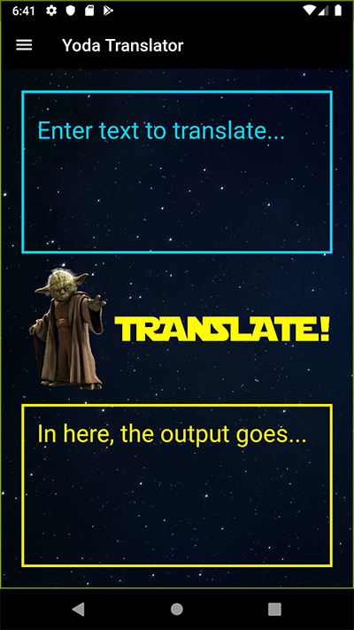

# Yoda Translator App

## What is This?

The Yoda Translator app takes a normal English sentence and translates it into Yodish. It was written for a presentation at [Dayton Web Developers](https://www.meetup.com/dayton-web-developers/) to provide an overview of the [Flutter](https://flutter.dev/) framework. [Watch the Presentation](https://www.youtube.com/watch?v=CYACheicTL4)

## What API did you use for the translations?
https://rapidapi.com/orthosie/api/yoda-translator

## How can I connect with you?
I'm on [Twitter](https://twitter.com/MatthewJones517) and someday I hope to re-launch my [portfolio site](http://www.MatthewRJones.me).

## Tell Me More About This Presentation!

### Title
Stay on target! Using Flutter to create multi-platform applications in one hit

### Description

What if I told you “write once run everywhere” code was possible without Jedi mind tricks? An Alliance of engineers at Google have made this possible without turning to the dark side!

Behold... The power of The Force... I mean Flutter...

Flutter is more powerful than you can possibly imagine. It can deploy native apps to iOS and Android, in addition to the web. No confusing WebPack configurations. No HTML / CSS / JavaScript / Java / Swift / C# / Objective C. Just a single, performant Dart code base that does everything you need.

Together we will build a “Yoda Translator” app from scratch. We’ll start by generating the basic Flutter scaffold. By the end we’ll have a fully functioning app that can take any English sentence and translate it into Yodish.

The framework that you are looking for, this is! Come to this session to learn how Flutter can help you prototype and deploy applications in record time!

### Presentation Slides
https://docs.google.com/presentation/d/1SnhrabpRd8TvGFZ_86k6BTtjxWDzMSmoHjtMytzmIy0/edit?usp=sharing
